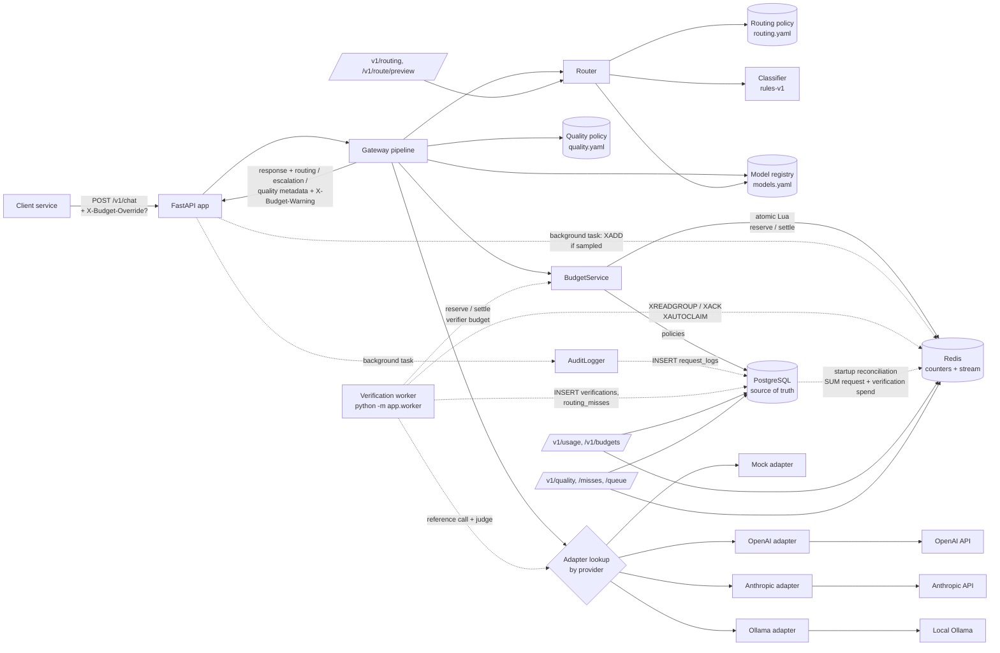
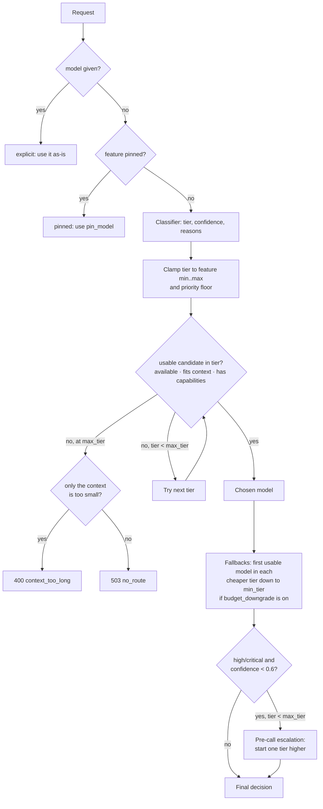
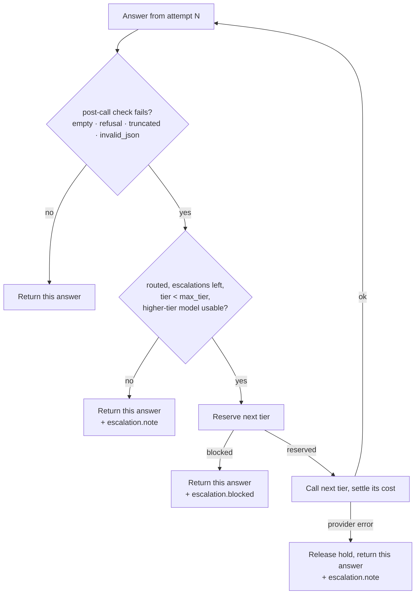
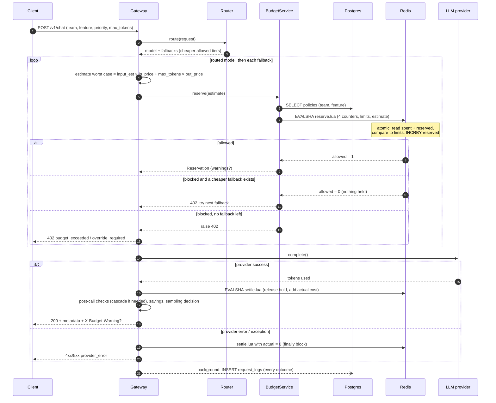
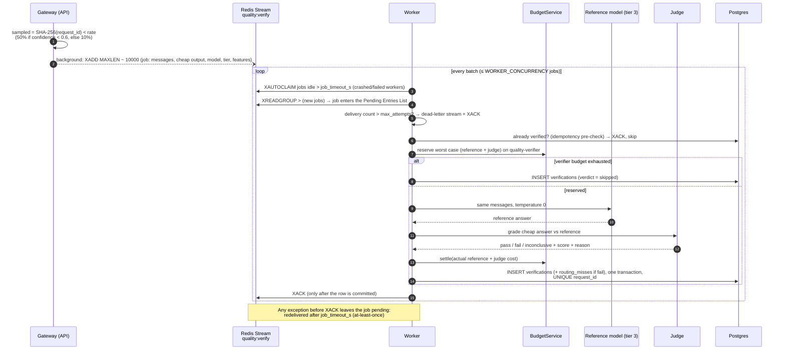

# Architecture

## Current state (after Phase 4)



Solid arrows are on the request's critical path; dotted arrows happen after the response, in
the worker process, or at startup. `routing.yaml` and `quality.yaml` are loaded and validated
once at startup by `app/bootstrap.py`, the composition root shared by the API and the worker.

## Request lifecycle

1. **Validate**: Pydantic validates the body against `ChatRequest`. A bad body returns 422 and
   is still audited (`status = validation_error`).
2. **Route**: the `Router` picks a model and tier (see [Routing decision](#routing-decision)).
   An explicit `model` is honoured; an unknown one returns 400. The decision carries cheaper
   `fallbacks` if the feature allows budget downgrade.
3. **Pre-call escalation** (Phase 4): a *routed* `high`/`critical` request whose classifier
   confidence is below `escalation.pre_call.confidence_below` starts one tier higher (never
   above `max_tier`); the original model becomes the first budget fallback.
4. **Context check**: estimated input tokens (~4 chars/token + 4 per message) + `max_tokens`
   must fit in the model's `max_context`.
5. **Estimate worst-case cost**: estimated input tokens at the input price + **all** of
   `max_tokens` at the output price, as a `Decimal`.
6. **Reserve**: `BudgetService.reserve()` atomically checks `spent + reserved + estimate`
   against every limit (team/feature × day/month) in one Lua script and holds the estimate.
   - ≥ 100% → **downgrade** to the next cheaper fallback, else `402 budget_exceeded` /
     `402 override_required` (a valid `X-Budget-Override` is allowed and flagged).
   - ≥ 80% → allowed with warnings and a deduplicated `budget_alerts` row.
   - Redis/Postgres unreachable → `BUDGET_FAIL_MODE` decides: allow unchecked, or `503`.
7. **Dispatch** to the provider adapter; latency timed with `perf_counter`.
8. **Settle**: release the hold, add the actual cost. Any exception after step 6 releases the
   hold in `finally` instead.
9. **Post-call checks and cascade** (Phase 4): the answer is checked for *visible* failures
   (empty, refusal, `finish_reason` length/max_tokens, invalid JSON when JSON was requested).
   On a failure, if the request was routed and a higher allowed tier exists, steps 5–8 repeat
   once on the next tier (`max_escalations`). Blocked or failed escalations keep the original
   answer and add a note. See [Escalation cascade](#escalation-cascade).
10. **Sample** (Phase 4): a deterministic hash of the request id decides whether a stronger
    model should double-check this answer later (routed, tier < 3, not escalated).
11. **Respond**: canonical `ChatResponse` (money as fixed-point strings) with
    `metadata.routing`, `metadata.escalation` and `metadata.quality`, plus `X-Budget-Warning`.
12. **After the response** (background tasks): the `request_logs` row is inserted (one row,
    summed cost of all attempts), and a sampled job is `XADD`ed to the verification stream.
    Neither can fail the request. Errors carry their audit record to the error handler.

## Routing decision



Classifier (`rules-v1`) signals, matched in the system prompt + latest user message:

| Signal | Effect | Confidence |
|---|---|---|
| Risk keyword (`contract`, `medical`, ...) | tier 3 | 0.9 |
| Keywords from one tier only | that tier | 0.85 |
| Keywords from several tiers | highest tier | 0.65 |
| No keywords | tier 1 (optimistic default) | 0.5 |
| Code present / input > `long_context_tokens` | at least tier 2 | unchanged |

## Escalation cascade



The audit row stores `model` = the model that produced the returned answer and `cost_usd` =
the sum of all attempts; `metadata.escalation.attempts` lists each attempt with its cost and
the check it failed. Escalated requests are not sampled for async verification.

## Reserve → call → settle → log



## Sample → enqueue → worker → reference → judge → store → ack



## Redis key layout

```
budget:{scope}:{scope_id}:day:{YYYY-MM-DD}:spent       integer nano-dollars
budget:{scope}:{scope_id}:day:{YYYY-MM-DD}:reserved
budget:{scope}:{scope_id}:month:{YYYY-MM}:spent
budget:{scope}:{scope_id}:month:{YYYY-MM}:reserved
alert:budget:{scope}:{scope_id}:{period}:{key}:{threshold}   SET NX dedup marker
quality:verify                                           stream of verification jobs
                                                         (consumer group "verifiers")
quality:verify:dead                                      dead-letter stream (reason, attempts)
```

Budget TTL = time until the period resets + 24 h grace. Counters are kept for **every** team
and feature (not only those with a policy). Streams are capped with approximate `MAXLEN`.

## Processes

| Process | Command | Scales by | Holds |
|---|---|---|---|
| API | `python -m uvicorn app.main:app` | more uvicorn workers/instances | no state (Postgres + Redis) |
| Verification worker | `python -m app.worker` | more worker processes: the consumer group splits jobs | only in-flight jobs (pending in Redis) |

Both build their dependencies with `build_core()` in `app/bootstrap.py`; the worker never
imports the web app.

## Key design principles

| Principle | Where it shows up |
|---|---|
| Single choke point | All LLM traffic passes through `Gateway.handle()`, the home of routing, budgets and escalation |
| Canonical schema / anti-corruption layer | Provider quirks are confined to adapters; the core only sees `ChatRequest`/`ProviderResult` |
| Adapter pattern + Open/Closed | New provider = new adapter file + one line in `build_adapters()` |
| Strategy pattern | Classifier behind `classify()`; judges behind `Judge.judge()` (similarity ↔ LLM) |
| Mechanism vs policy | Router and gateway are code; tiers, escalation rules, sampling rates live in YAML |
| Config as data | Prices, tiers, routing and quality rules in YAML; limits in `budget_policies` |
| Fail fast | `routing.yaml` and `quality.yaml` are validated at startup; a bad config stops the process |
| Centralised cost logic | Adapters report tokens only; cost is computed once from the registry, as `Decimal` |
| Uniform errors | Every failure returns a `GatewayError` shape |
| Reserve-then-settle | Enforce before spending, account after knowing; applies to escalation attempts and verifications too |
| Graceful degradation | Budget block → downgrade; failed/blocked escalation → original answer; queue down → no verification, request unaffected |
| At-least-once + idempotency | Ack after commit; UNIQUE `verifications.request_id` makes redelivery harmless |
| Separate worker process | Slow verification never competes with user requests; scales and deploys independently |
| Explainability | Routing reasons, escalation attempts and sampling decisions are stored per request |
| Source of truth vs cache | Postgres is authoritative; Redis counters are rebuildable (request + verification spend) |
| Data minimisation | Stored prompts are optional and capped; listings show previews only |
| Dependency injection | `build_core()` wires everything once; tests inject SQLite + fakeredis |
| Layering | `api/` (HTTP) → `gateway` (orchestration) → `routing/`, `budgets/`, `quality/`, `audit` (domain) → `db/`, Redis (infrastructure) |

## Planned evolution

| Phase | Adds |
|---|---|
| 5 | Dashboard over `request_logs`, `verifications`, `routing_misses` and `budget_alerts`: spend, savings, miss rate, escalation rate |
| 6 | Simulated 1,000-request workload through the full pipeline (incl. verification); savings report net of quality overhead |
