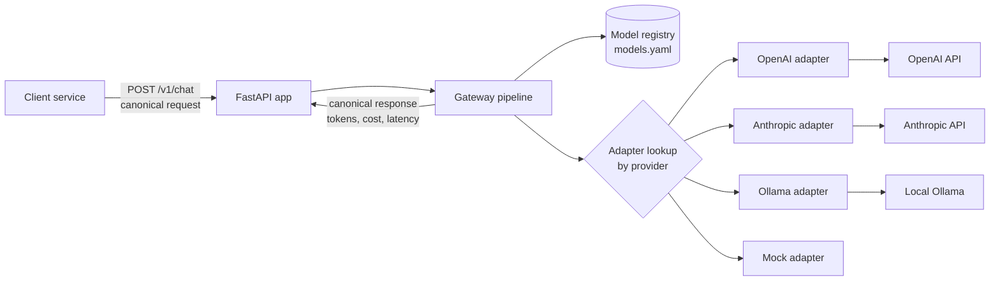

# Architecture

## Current state (after Phase 1)

## Request lifecycle

1. **Validate**: Pydantic validates the body against `ChatRequest`. Bad input returns a 422 before any logic runs.
2. **Resolve model**: use `request.model`, or fall back to the registry default. Unknown model returns 400.
3. **Context check**: estimate input tokens (~4 chars/token) + `max_tokens` and compare to the model's `max_context`.
4. **Dispatch**: the gateway looks up the adapter by `spec.provider` and calls `adapter.complete()`.
5. **Measure**: latency is timed with `time.perf_counter()` around the adapter call.
6. **Cost**: `ModelSpec.cost(input_tokens, output_tokens)` uses the registry's per-MTok prices.
7. **Respond**: return a canonical `ChatResponse`, the same shape for every provider.

## Key design principles

| Principle | Where it shows up |
|---|---|
| Single choke point | All LLM traffic passes through `Gateway.handle()`, the future home of budgets and routing |
| Canonical schema / anti-corruption layer | Provider quirks are confined to adapters; the core only sees `ChatRequest`/`ProviderResult` |
| Adapter pattern + Open/Closed | New provider = new adapter file + one line in `build_adapters()` |
| Config as data | Prices, tiers and limits live in YAML, not code |
| Centralised cost logic | Adapters report tokens only; cost is computed once from the registry |
| Uniform errors | Every failure returns a `GatewayError` shape with a `retryable` flag |

## Planned evolution

| Phase | Adds to the pipeline |
|---|---|
| 2 | Budget reservation before dispatch → settle actual cost after; audit log write |
| 3 | Router replaces "default model" step with complexity-tier selection |
| 4 | Post-response sampling to a verifier queue; escalation for high-risk requests |
| 5 | Dashboard reading from the audit log |