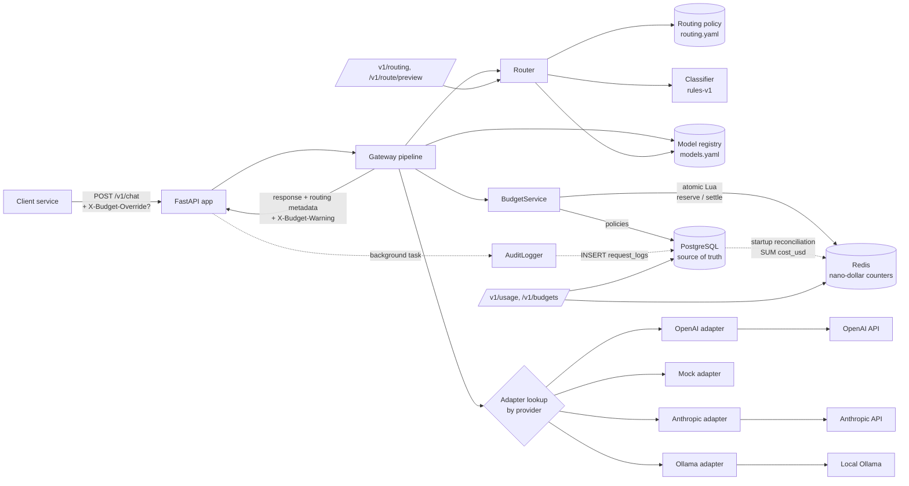
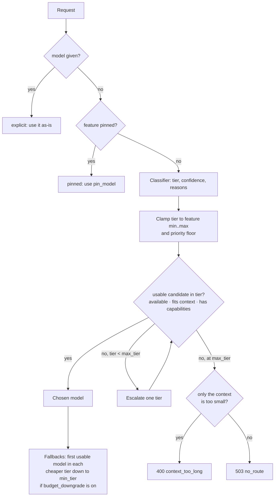
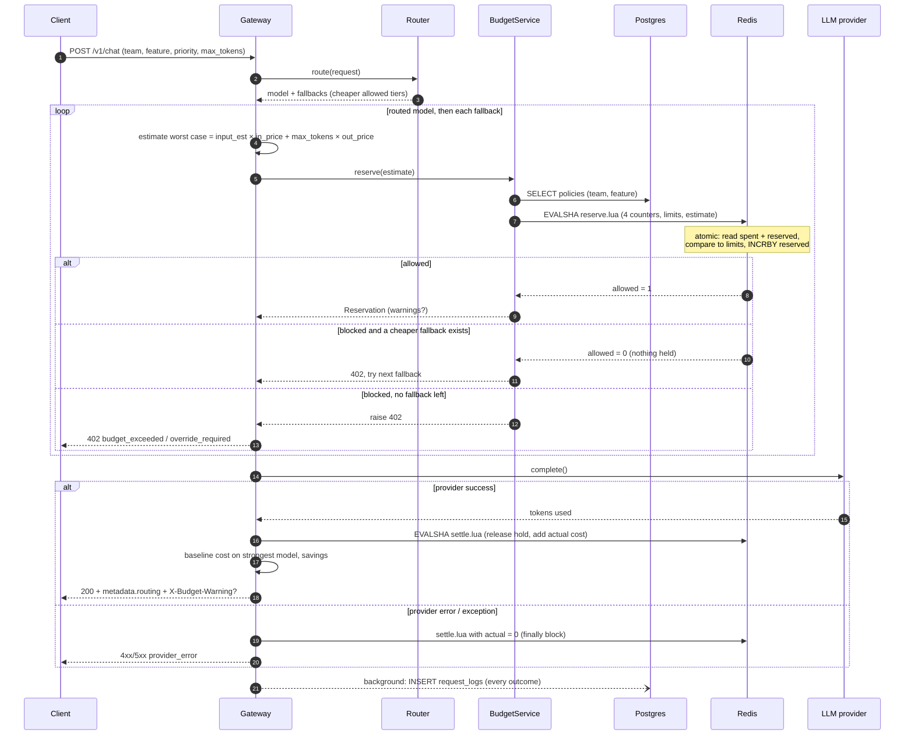

# Architecture

## Current state (after Phase 3)



Solid arrows are on the request's critical path; dotted arrows happen after the response or
at startup. `routing.yaml` is loaded and validated against `models.yaml` once, at startup.

## Request lifecycle

1. **Validate**: Pydantic validates the body against `ChatRequest`. A bad body returns 422 and
   is still audited (`status = validation_error`).
2. **Route**: the `Router` picks a model and tier (see [Routing decision](#routing-decision)).
   An explicit `model` is honoured; an unknown one returns 400. The decision carries cheaper
   `fallbacks` if the feature allows budget downgrade.
3. **Context check**: estimated input tokens (~4 chars/token + 4 per message) + `max_tokens`
   must fit in the model's `max_context`.
4. **Estimate worst-case cost**: estimated input tokens at the input price + **all** of
   `max_tokens` at the output price, as a `Decimal`.
5. **Reserve**: `BudgetService.reserve()` loads the team and feature policies from Postgres,
   then runs one Lua script in Redis that, atomically, checks `spent + reserved + estimate`
   against every limit (team/feature × day/month) and, if allowed, adds the estimate to each
   `:reserved` counter.
   - ≥ 100% of a limit → **downgrade**: if the route has cheaper fallbacks, steps 3–5 repeat
     with the next one (a blocked attempt holds nothing, since the script is all-or-nothing).
     With no fallback left → `402 budget_exceeded`, or `402 override_required` for
     high/critical priority without an override. A valid override is allowed and flagged.
   - ≥ 80% → allowed with warnings (header + metadata) and a deduplicated `budget_alerts` row.
   - Redis/Postgres unreachable → `BUDGET_FAIL_MODE` decides: allow unchecked, or `503`.
6. **Dispatch**: the adapter for `spec.provider` is called; latency is timed with `perf_counter`.
7. **Settle**: a second Lua script subtracts the hold from `:reserved` and adds the actual cost
   to `:spent`. On any exception after step 5, `finally` **releases** the hold instead (adds nothing).
8. **Respond**: canonical `ChatResponse` (money as fixed-point strings) with `metadata.routing`
   (decision, reasons, downgrades, baseline cost and savings) plus `X-Budget-Warning` when applicable.
9. **Audit** (after the response is sent): a background task inserts the `request_logs` row,
   routing metadata included. Errors carry their audit record to the error handler, which
   attaches the same write to the error response.

## Routing decision



Classifier (`rules-v1`) signals, matched in the system prompt + latest user message:

| Signal | Effect | Confidence |
|---|---|---|
| Risk keyword (`contract`, `medical`, ...) | tier 3 | 0.9 |
| Keywords from one tier only | that tier | 0.85 |
| Keywords from several tiers | highest tier | 0.65 |
| No keywords | tier 1 (optimistic default) | 0.5 |
| Code present / input > `long_context_tokens` | at least tier 2 | unchanged |

## Reserve → call → settle → log



## Redis key layout

```
budget:{scope}:{scope_id}:day:{YYYY-MM-DD}:spent       integer nano-dollars
budget:{scope}:{scope_id}:day:{YYYY-MM-DD}:reserved
budget:{scope}:{scope_id}:month:{YYYY-MM}:spent
budget:{scope}:{scope_id}:month:{YYYY-MM}:reserved
alert:budget:{scope}:{scope_id}:{period}:{key}:{threshold}   SET NX dedup marker
```

TTL = time until the period resets + 24 h grace. Counters are kept for **every** team and
feature (not only those with a policy), so a policy created mid-day immediately sees the
spend so far.

## Key design principles

| Principle | Where it shows up |
|---|---|
| Single choke point | All LLM traffic passes through `Gateway.handle()`, the home of routing and budgets |
| Canonical schema / anti-corruption layer | Provider quirks are confined to adapters; the core only sees `ChatRequest`/`ProviderResult` |
| Adapter pattern + Open/Closed | New provider = new adapter file + one line in `build_adapters()` |
| Strategy pattern | The classifier sits behind `classify()`; a learned model can replace `rules-v1` without touching the router |
| Mechanism vs policy | The router is code; tiers, feature rules and keywords live in `routing.yaml` |
| Config as data | Prices, tiers, routing rules and limits live in YAML and in the `budget_policies` table, not code |
| Fail fast | `routing.yaml` is validated against the registry at startup; a bad config stops the server |
| Centralised cost logic | Adapters report tokens only; cost is computed once from the registry, as `Decimal` |
| Uniform errors | Every failure, budget blocks and routing failures included, returns a `GatewayError` shape |
| Reserve-then-settle | Enforce before spending, account after knowing; atomic in Redis |
| Graceful degradation | A budget block downgrades to a cheaper allowed tier before denying |
| Explainability | Every routing decision stores its reasons, features, confidence and downgrades |
| Source of truth vs cache | Postgres is authoritative; Redis counters are rebuildable from it |
| Dependency injection | `create_app()` wires engine/Redis/services/router once; tests inject SQLite + fakeredis |
| Layering | `api/` (HTTP) → `gateway` (orchestration) → `routing/`, `budgets/`, `audit` (domain) → `db/`, Redis (infrastructure) |

## Planned evolution

| Phase | Adds to the pipeline |
|---|---|
| 4 | Sample cheap-model responses to an async verifier queue; record routing misses; escalate low-confidence / high-risk requests to a stronger model |
| 5 | Dashboard reading from `request_logs` (incl. `metadata.routing`) and `budget_alerts` |
| 6 | Simulated 1,000-request workload through the full pipeline; savings report |