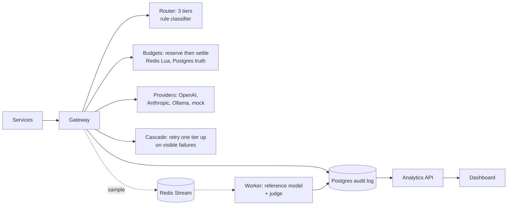
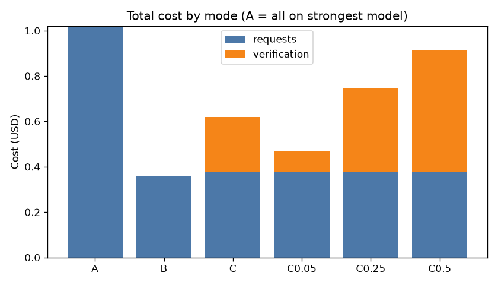
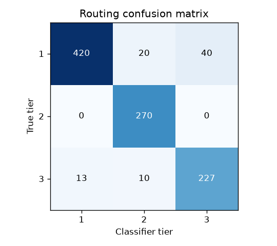
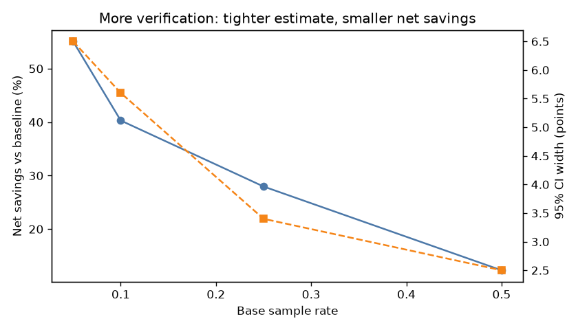

# Case Study: LLM Spend Control Center

> **Reduced simulated LLM spend by 40.3% (net of verification; 63.7% gross) while maintaining a
> 97.4% verification pass rate (95% CI 93.4–99.0%), with 98.0% of requests served at or above
> their required model tier.**
>
> 1,000 labelled prompts · mock models priced like real tiers · run `final-v2`, commit `3701c2d` ·
> [full report](../reports/final-v2/report.md)

## The problem

Teams that ship LLM features usually call one strong model for everything. It works, and it's
expensive: most traffic is extraction, formatting and short summaries that a model a tenth of the
price handles fine. But "just use a cheaper model" raises three questions nobody can answer
without infrastructure:

1. **Which** requests can go cheap, and how do you know you didn't get it wrong?
2. How do you stop one team or feature from blowing the monthly budget, *before* the money is spent?
3. How much do you really save once the cost of checking quality is included?

## What I built

A gateway every LLM call goes through. Six phases, each tested and documented:

| Concern | Design |
|---|---|
| One choke point | All calls go through `/v1/chat`; provider quirks live in adapters |
| Exact money | `Decimal` in Python, `NUMERIC(14,8)` in Postgres, integer nano-dollars in Redis |
| Budgets | **Reserve-then-settle**: hold the worst-case cost atomically (Lua) before the call, swap in the actual cost after; a hotel card pre-authorisation |
| Routing | Classifier picks tier 1–3 (extraction / summarisation / reasoning-or-risk), clamped by feature rules; downgrades before blocking when budgets are tight |
| Quality, synchronous | Post-call checks (empty, refusal, cut off, bad JSON) trigger one retry on the next tier |
| Quality, asynchronous | A sample of cheap answers is re-asked to a tier-3 model and judged; failures become labelled "routing misses" |
| Visibility | Analytics API + Streamlit dashboard: spend, projections, gross vs net savings, pass rates with confidence intervals |

Request lifecycle: route → pre-call escalation → reserve (downgrade if blocked) → provider call →
settle → post-call checks / cascade → sample for verification → audit row.
Details: [architecture](architecture.md).

## The experiment

1,000 prompts from templates with **ground-truth tiers** (48% tier 1, 27% tier 2, 25% tier 3),
including deliberately tricky cases: hard questions with no keywords, easy tasks that say
"analyze", negation, code, JSON output, 27,000-character documents, multi-turn chats, and 30
simulated visible failures. Held-out split by template (301 prompts).

Three modes on the same prompts, each with its own server and pinned config:
**A** everything on the strongest model · **B** routing only · **C** routing + verification (10%
base sample rate, 50% when the classifier is unsure) + escalation.

## Results

| Mode | Cost per 1,000 requests | Savings vs A (paired, 975 requests) | Served ≥ required tier |
|---|---|---|---|
| A: all strongest | $1.02 | – | 100% |
| B: routing only | $0.36 | 65.5% | 97.7% |
| C: full system | $0.62 (incl. $0.24 verification) | 63.7% gross · **40.3% net** | **98.0%** |

**Routing is safe, and the cascade fixes visible failures.** All 23 genuinely broken cheap answers
(empty, refusal, cut off) were rescued by escalating one tier. Of 152 verified cheap answers,
97.4% passed (Wilson 95% CI 93.4–99.0%). The 4 failures were all long documents.

**Budgets bite where they should.** The same $0.03/day budget that blocked 25 of 50 marketing
requests under the all-strongest baseline was never even approached with routing on.

**Improving the classifier, honestly.** Training-split misses showed three patterns: keywords in
the *data* rather than the task ("list the names in: ...to review the plan"), negation ("don't
analyze, just list"), and hard questions with no keywords ("what could be going on?"). Three
generic rules (`rules-v2`), measured once on the held-out split:

| Held-out (301 prompts) | Accuracy | Under-routed (dangerous) | Over-routed (wasteful) |
|---|---|---|---|
| rules-v1 | 83.4% | 23 | 27 |
| rules-v2 | **92.4%** | **6** | 17 |

End to end, v2 cut under-served requests in mode C from 5.4% to 2.0% *and* raised gross savings
from 61.7% to 63.7%: safer and cheaper, because it also over-routes less.

**Quality assurance is a cost line.** Verification is where gross savings leak:

| Base sample rate | Verified | Pass rate (95% CI) | Net savings |
|---|---|---|---|
| 5% | 81 | 98.8% (93.3–99.8) | 55.1% |
| 10% | 152 | 97.4% (93.4–99.0) | 40.3% |
| 25% | 277 | 98.2% (95.8–99.2) | 28.0% |
| 50% | 406 | 98.5% (96.8–99.3) | 12.3% |

More checking narrows the interval but costs savings almost linearly, because each check calls a
tier-3 model.

## What the numbers do *not* say

- **Mock models.** Costs follow real price ratios, but answer quality is simulated: the similarity
  judge only sees length and format problems. It passed every under-routed answer it was shown,
  which is why routing quality is also scored against ground truth. With real models an LLM judge
  is needed.
- **Run-to-run variance.** Which requests get sampled is random. At 10%, net savings ranged from
  about 40% to 53% across runs, because a handful of 27,000-character documents dominate
  verification cost. Sampling stratified by request size would stabilise it.
- **Counterfactual baseline.** Savings price the *actual* tokens on the strongest model, which might
  have written more or less.
- **Synthetic, self-labelled data.** The dataset and the classifier share an author; the held-out
  split is by template to limit leakage, but real traffic will be harder.
- 47 "broken" answers remain in mode C: all are JSON-output prompts, because mock models never emit
  real JSON. That's a property of the mocks, not of the cascade.

## Trade-offs I'd revisit

- **Sampling design**: stratify by request size and cost; spend a fixed verification budget where
  the classifier is least sure.
- **A learned classifier**: the routing-miss export is labelled training data; a small model
  behind the same `classify()` interface would replace keyword rules.
- **Production hardening**: authentication on every endpoint, a read replica or warehouse for
  analytics, Redis Cluster hash tags, and alerting on miss and escalation rates.

## Bugs that measurement caught

Several results looked plausible and were wrong. Each was caught by checking that the numbers
added up:
- the verifier budget was silently reset by every restart (reconciliation ignored verification spend);
- a shared feature budget made simulation results depend on run order;
- a shared verification stream let another worker judge simulation jobs with the wrong config;
- a reused run id started a run with spent budgets;
- two analytics queries passed on SQLite and failed on Postgres (`GROUP BY` binds, a `datetime` overflow).

## Read more

[README](../README.md) · [architecture](architecture.md) · [API](api.md) ·
[interview notes](interview-notes.md) · phase design notes: [2](phases/phase-2-budgets.md) ·
[3](phases/phase-3-routing.md) · [4](phases/phase-4-quality.md) · [5](phases/phase-5-dashboard.md) ·
[6](phases/phase-6-simulation.md) · [simulation report](../reports/final-v2/report.md)
