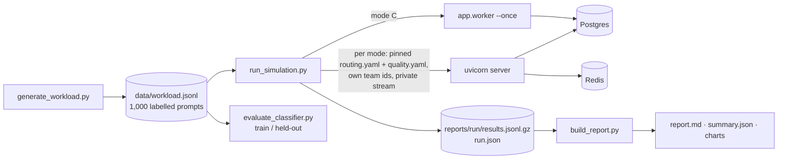

# Phase 6: Simulated Workload, Case Study and Portfolio Polish

## Goal
Prove the system with numbers: run a reproducible, labelled 1,000-prompt workload through the full
pipeline, measure cost and quality honestly, improve the classifier on evidence, and make the
repository easy to run, test and evaluate.

## What was built
- `scripts/generate_workload.py` → `data/workload.jsonl`: 1,000 prompts, 18 categories, ground-truth
  tiers, tricky cases, train/test split by template (deterministic, committed, tested)
- `scripts/run_simulation.py`: modes A/B/C (+ sample-rate sweep, optional `--real`), a server per
  mode with pinned configs, async load generator (concurrency + token bucket + jittered retries),
  worker drain, results to `reports/<run>/results.jsonl.gz`
- `scripts/build_report.py`: paired savings, confusion matrix, under/over-routing, adequacy,
  Wilson intervals, escalation rescue, budgets, latency, charts, `summary.json`; offline
- `scripts/evaluate_classifier.py` and `rules-v2` (selectable in `routing.yaml`)
- Dockerfile + compose profile `full` (migrate, gateway, worker, dashboard), `scripts/dev.ps1`
- GitHub Actions CI (ruff; pytest on 3.11 and 3.13; smoke tests on service containers);
  ruff configuration in `pyproject.toml`
- Case study, interview notes, README overhaul, release notes

## Simulation flow



## Design decisions

**Ground truth by template, split by template.** Each template carries a human tier label;
~30% of each category's templates are held out, so near-duplicate prompts never span the split.

**Same dataset, one variable at a time.** A, B and C differ only in configuration. Each mode's
exact `quality.yaml` and the run's `routing.yaml` are saved in the report folder.

**Paired savings.** Modes can block different requests (a blocked request costs $0); headline
savings use only requests that succeeded in both modes.

**Isolation is a feature.** Per-mode team ids, a private verification stream per mode, a check
for budget policies on workload features, and a refusal to reuse a run id. Each was added after
a real contamination bug.

**Adequacy next to the pass rate.** With mock models the similarity judge can't see
under-routing, so the report scores served tiers against ground truth too.

**Evidence-driven classifier change.** `rules-v2` came from training-split misses only and is
measured once on the held-out split; it's selected with `classifier.version` in `routing.yaml`.

**Regenerable reports.** `build_report.py` needs only the results file; compressed results are
committed so anyone can rebuild the report and charts.

**One image, three services.** Gateway, worker and dashboard share code; compose profiles keep
the old "infrastructure only" workflow intact.

## Known limitations
- Mock models: quality is simulated (length/format), costs are real price ratios
- Verification sampling is per request id (random): net savings at 10% varied ~40–53% between
  runs, driven by a few very long documents
- Synthetic, self-labelled dataset; the dataset and classifier share an author
- Counterfactual baseline reuses actual output tokens
- `--real` mode is implemented (production profile, capped budgets) but not part of the reported
  results; it needs API keys and costs money
- CI was validated locally (YAML, ruff, pytest on 3.11 and 3.13, smoke tests) but has not yet
  run on GitHub
- No authentication anywhere

## Key formulas
```
paired gross savings = (Σ A_cost − Σ X_cost) / Σ A_cost        over requests ok in both A and X
paired net savings   = (Σ A_cost − Σ X_cost − Σ X_verification) / Σ A_cost
under-routed         = served_tier < true_tier        (dangerous)
over-routed          = served_tier > true_tier        (wasteful)
adequately served    = 1 − under-routed share
token bucket         = tokens += Δt × rate (≤ capacity); send when tokens ≥ 1
backoff(attempt)     = uniform(0, min(cap, base × 2^attempt))
```

## Interview talking points
- The headline and what it does not prove (mocks, variance, counterfactual)
- Paired comparison and isolation: three contamination bugs, how each was spotted and guarded
- Held-out evaluation by template; train-only design of rules-v2; 83.4% → 92.4%, under-routing 23 → 6
- The sample-rate sweep: verification cost is roughly linear in the rate; net savings 55% → 12%
- One image, three services; compose networking; CI matrix with service containers
