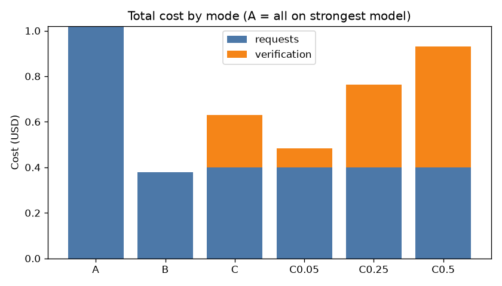
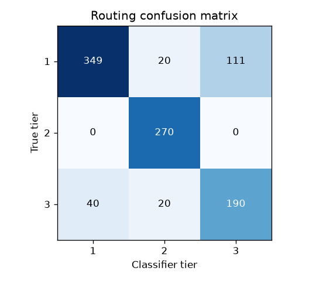
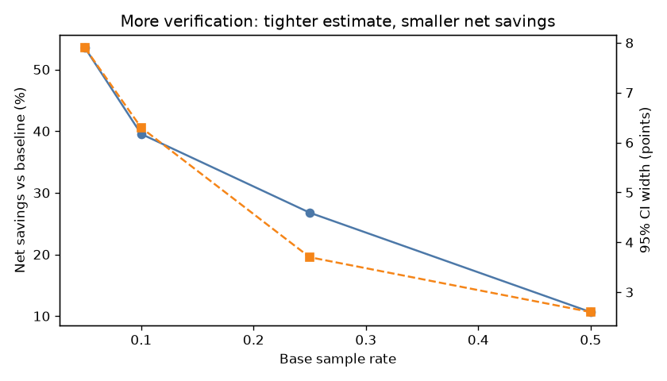
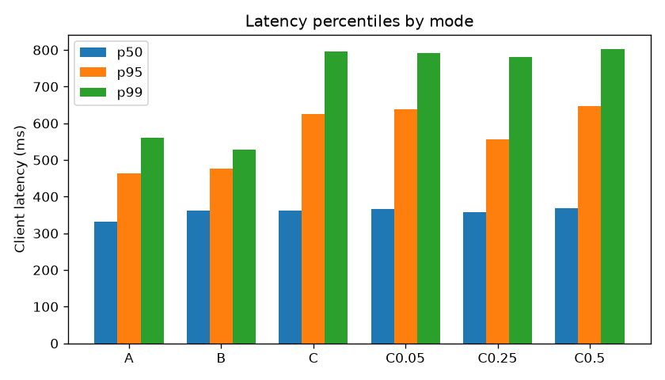

# Simulation report: run `final-v1`

> **Dev profile**: mock models priced like real tiers. Costs follow real price ratios; answer quality is *simulated* (see Limitations).

## Headline

**Reduced simulated LLM spend by 39.5% (net of verification; 61.7% gross) while maintaining a 97.0% verification pass rate (95% CI 92.5-98.8%, 133 verified answers); 94.6% of requests were served at or above their ground-truth tier.**

Prompts: 1000 · commit `3701c2d` · dataset sha256 `6f6c16ca3da08458`

## Cost

| Mode | Requests | OK | Blocked | Errors | Request cost | Verification | Total | Per 1k requests |
|---|---|---|---|---|---|---|---|---|
| A | 1000 | 975 | 25 | 0 | $1.0208 | $0.0000 | $1.0208 | $1.0208 |
| B | 1000 | 1000 | 0 | 0 | $0.3795 | $0.0000 | $0.3795 | $0.3795 |
| C | 1000 | 1000 | 0 | 0 | $0.3984 | $0.2315 | $0.6300 | $0.6300 |
| C0.05 | 1000 | 1000 | 0 | 0 | $0.3984 | $0.0840 | $0.4824 | $0.4824 |
| C0.25 | 1000 | 1000 | 0 | 0 | $0.3984 | $0.3644 | $0.7628 | $0.7628 |
| C0.5 | 1000 | 1000 | 0 | 0 | $0.3984 | $0.5325 | $0.9309 | $0.9309 |

Savings vs A on the **paired** set (requests that succeeded in both modes):

| Mode | Paired | Baseline cost | Mode cost | Verification | Gross savings | Net savings |
|---|---|---|---|---|---|---|
| B | 975 | $1.0208 | $0.3716 | $0.0000 | 63.6% | 63.6% |
| C | 975 | $1.0208 | $0.3906 | $0.2266 | 61.74% | 39.54% |
| C0.05 | 975 | $1.0208 | $0.3906 | $0.0840 | 61.74% | 53.51% |
| C0.25 | 975 | $1.0208 | $0.3906 | $0.3570 | 61.74% | 26.77% |
| C0.5 | 975 | $1.0208 | $0.3906 | $0.5215 | 61.74% | 10.65% |

### Cost by served tier

| Mode | Tier 1 | Tier 2 | Tier 3 |
|---|---|---|---|
| A | – | – | 975 req · $1.0208 |
| B | 389 req · $0.0060 | 310 req · $0.2154 | 301 req · $0.1581 |
| C | 302 req · $0.0044 | 380 req · $0.2264 | 318 req · $0.1676 |
| C0.05 | 302 req · $0.0044 | 380 req · $0.2264 | 318 req · $0.1676 |
| C0.25 | 302 req · $0.0044 | 380 req · $0.2264 | 318 req · $0.1676 |
| C0.5 | 302 req · $0.0044 | 380 req · $0.2264 | 318 req · $0.1676 |

## Routing quality

Classifier tier vs ground-truth tier (routed requests):

| Split | Scored | Accuracy | Under-routed (dangerous) | Over-routed (wasteful) |
|---|---|---|---|---|
| all | 1000 | 80.9% | 60 (6.0%) | 131 (13.1%) |
| train | 699 | 79.83% | 37 (5.29%) | 104 (14.88%) |
| test | 301 | 83.39% | 23 (7.64%) | 27 (8.97%) |

Per tier (all): tier 1: precision 89.72% / recall 72.71%, tier 2: precision 87.1% / recall 100.0%, tier 3: precision 63.12% / recall 76.0%

**Served tier, mode B** (after feature rules, pre-call escalation, downgrades and the cascade): accuracy 80.9%, **adequately served 94.0%**, under-routed 6.0%, over-routed 13.1%.

**Served tier, mode C** (after feature rules, pre-call escalation, downgrades and the cascade): accuracy 73.5%, **adequately served 94.6%**, under-routed 5.4%, over-routed 21.1%.

**Served tier, mode C0.05** (after feature rules, pre-call escalation, downgrades and the cascade): accuracy 73.5%, **adequately served 94.6%**, under-routed 5.4%, over-routed 21.1%.

**Served tier, mode C0.25** (after feature rules, pre-call escalation, downgrades and the cascade): accuracy 73.5%, **adequately served 94.6%**, under-routed 5.4%, over-routed 21.1%.

**Served tier, mode C0.5** (after feature rules, pre-call escalation, downgrades and the cascade): accuracy 73.5%, **adequately served 94.6%**, under-routed 5.4%, over-routed 21.1%.

## Escalation

Visibly broken answers returned to users: **70 in B** (no escalation) vs **47 in C**; 23 rescued by the cascade.
- A: cheap attempt failed 0 , escalated 0, pre-call escalations 0, returned broken 0 
- B: cheap attempt failed 70 {'empty': 8, 'invalid_json': 47, 'refusal': 8, 'truncated': 7}, escalated 0, pre-call escalations 0, returned broken 70 {'empty': 8, 'invalid_json': 47, 'refusal': 8, 'truncated': 7}
- C: cheap attempt failed 69 {'empty': 8, 'invalid_json': 47, 'refusal': 8, 'truncated': 6}, escalated 69, pre-call escalations 35, returned broken 47 {'invalid_json': 47}
- C0.05: cheap attempt failed 69 {'empty': 8, 'invalid_json': 47, 'refusal': 8, 'truncated': 6}, escalated 69, pre-call escalations 35, returned broken 47 {'invalid_json': 47}
- C0.25: cheap attempt failed 69 {'empty': 8, 'invalid_json': 47, 'refusal': 8, 'truncated': 6}, escalated 69, pre-call escalations 35, returned broken 47 {'invalid_json': 47}
- C0.5: cheap attempt failed 69 {'empty': 8, 'invalid_json': 47, 'refusal': 8, 'truncated': 6}, escalated 69, pre-call escalations 35, returned broken 47 {'invalid_json': 47}

Mock models never emit real JSON, so `invalid_json` failures on JSON-output prompts survive escalation in the dev profile: that remainder is a property of the mocks, not of the cascade.

## Verification (mode C, sample rate 0.1)

133 verified: 129 pass, 4 fail, 0 inconclusive, 0 skipped. Pass rate **96.99%** (95% Wilson CI [92.5, 98.8]). Fail rate among under-routed verified answers: 0.0%.

Misses by category: long_input 4

## Verification (mode C0.05, sample rate 0.05)

65 verified: 64 pass, 1 fail, 0 inconclusive, 0 skipped. Pass rate **98.46%** (95% Wilson CI [91.8, 99.7]). Fail rate among under-routed verified answers: 0.0%.

Misses by category: long_input 1

## Verification (mode C0.25, sample rate 0.25)

258 verified: 253 pass, 5 fail, 0 inconclusive, 0 skipped. Pass rate **98.06%** (95% Wilson CI [95.5, 99.2]). Fail rate among under-routed verified answers: 0.0%.

Misses by category: long_input 5

## Verification (mode C0.5, sample rate 0.5)

387 verified: 381 pass, 6 fail, 0 inconclusive, 0 skipped. Pass rate **98.45%** (95% Wilson CI [96.7, 99.3]). Fail rate among under-routed verified answers: 0.0%.

Misses by category: long_input 6

## Sample-rate sweep

| Base rate | Verified | Pass rate | 95% CI | Verification cost | Net savings |
|---|---|---|---|---|---|
| 0.05 | 65 | 98.46% | [91.8, 99.7] | $0.0840 | 53.51% |
| 0.1 | 133 | 96.99% | [92.5, 98.8] | $0.2315 | 39.54% |
| 0.25 | 258 | 98.06% | [95.5, 99.2] | $0.3644 | 26.77% |
| 0.5 | 387 | 98.45% | [96.7, 99.3] | $0.5325 | 10.65% |

## Budgets

| Mode | Team | Requests | Warnings | Downgrades | Blocks | Overridden |
|---|---|---|---|---|---|---|
| A | marketing | 50 | 8 | 0 | 25 | 0 |

## Latency (client-side)

| Mode | p50 | p95 | p99 |
|---|---|---|---|
| A | 332.48 ms | 464.18 ms | 561.41 ms |
| B | 362.31 ms | 477.31 ms | 529.04 ms |
| C | 362.78 ms | 626.36 ms | 795.59 ms |
| C0.05 | 365.47 ms | 639.04 ms | 790.8 ms |
| C0.25 | 357.9 ms | 556.8 ms | 780.27 ms |
| C0.5 | 367.48 ms | 647.01 ms | 802.06 ms |

## What this means

- Routing moves most traffic off the strongest model; the gross saving comes mainly from tier-1 and tier-2 requests.
- Verification is the price of knowing the routing is safe: compare gross and net.
- The cascade turns visibly broken cheap answers into good ones at the cost of a second call on those requests only.
- Under-routing is the error to watch. Here it is measured against ground truth: with mock models the similarity judge cannot see it (a short prompt that needed tier 3 still gets an 'equivalent' echo from tier 1), so the verification pass rate overstates quality. With real models an LLM judge is needed to catch it.

## Limitations

- Mock models: answer quality depends on prompt length and test directives, not on true task difficulty, so pass rates are simulated; costs follow real price ratios.
- The baseline counterfactual prices the *actual* tokens on the strongest model; a stronger model might write a different number of tokens.
- Ground-truth tiers are one author's labels; the dataset and the classifier share an author, which risks overfitting (mitigated by the template-level held-out split).
- The keyword classifier is English-only.
- One run on one machine: latency numbers are for comparison between modes only.
