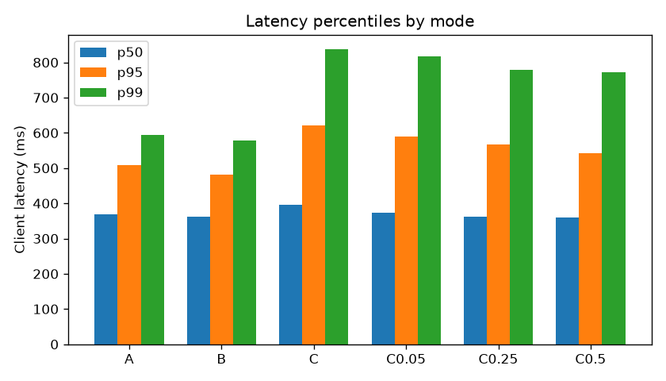

# Simulation report: run `final-v2`

> **Dev profile**: mock models priced like real tiers. Costs follow real price ratios; answer quality is *simulated* (see Limitations).

## Headline

**Reduced simulated LLM spend by 40.3% (net of verification; 63.7% gross) while maintaining a 97.4% verification pass rate (95% CI 93.4-99.0%, 152 verified answers); 98.0% of requests were served at or above their ground-truth tier.**

Prompts: 1000 · commit `3701c2d` · dataset sha256 `6f6c16ca3da08458`

## Cost

| Mode | Requests | OK | Blocked | Errors | Request cost | Verification | Total | Per 1k requests |
|---|---|---|---|---|---|---|---|---|
| A | 1000 | 975 | 25 | 0 | $1.0208 | $0.0000 | $1.0208 | $1.0208 |
| B | 1000 | 1000 | 0 | 0 | $0.3604 | $0.0000 | $0.3604 | $0.3604 |
| C | 1000 | 1000 | 0 | 0 | $0.3783 | $0.2417 | $0.6200 | $0.6200 |
| C0.05 | 1000 | 1000 | 0 | 0 | $0.3783 | $0.0911 | $0.4694 | $0.4694 |
| C0.25 | 1000 | 1000 | 0 | 0 | $0.3783 | $0.3700 | $0.7483 | $0.7483 |
| C0.5 | 1000 | 1000 | 0 | 0 | $0.3783 | $0.5337 | $0.9120 | $0.9120 |

Savings vs A on the **paired** set (requests that succeeded in both modes):

| Mode | Paired | Baseline cost | Mode cost | Verification | Gross savings | Net savings |
|---|---|---|---|---|---|---|
| B | 975 | $1.0208 | $0.3525 | $0.0000 | 65.47% | 65.47% |
| C | 975 | $1.0208 | $0.3705 | $0.2389 | 63.71% | 40.3% |
| C0.05 | 975 | $1.0208 | $0.3705 | $0.0880 | 63.71% | 55.09% |
| C0.25 | 975 | $1.0208 | $0.3705 | $0.3649 | 63.71% | 27.96% |
| C0.5 | 975 | $1.0208 | $0.3705 | $0.5249 | 63.71% | 12.29% |

### Cost by served tier

| Mode | Tier 1 | Tier 2 | Tier 3 |
|---|---|---|---|
| A | – | – | 975 req · $1.0208 |
| B | 433 req · $0.0066 | 300 req · $0.2138 | 267 req · $0.1400 |
| C | 347 req · $0.0051 | 372 req · $0.2251 | 281 req · $0.1481 |
| C0.05 | 347 req · $0.0051 | 372 req · $0.2251 | 281 req · $0.1481 |
| C0.25 | 347 req · $0.0051 | 372 req · $0.2251 | 281 req · $0.1481 |
| C0.5 | 347 req · $0.0051 | 372 req · $0.2251 | 281 req · $0.1481 |

## Routing quality

Classifier tier vs ground-truth tier (routed requests):

| Split | Scored | Accuracy | Under-routed (dangerous) | Over-routed (wasteful) |
|---|---|---|---|---|
| all | 1000 | 91.7% | 23 (2.3%) | 60 (6.0%) |
| train | 699 | 91.42% | 17 (2.43%) | 43 (6.15%) |
| test | 301 | 92.36% | 6 (1.99%) | 17 (5.65%) |

Per tier (all): tier 1: precision 97.0% / recall 87.5%, tier 2: precision 90.0% / recall 100.0%, tier 3: precision 85.02% / recall 90.8%

**Served tier, mode B** (after feature rules, pre-call escalation, downgrades and the cascade): accuracy 91.7%, **adequately served 97.7%**, under-routed 2.3%, over-routed 6.0%.

**Served tier, mode C** (after feature rules, pre-call escalation, downgrades and the cascade): accuracy 83.5%, **adequately served 98.0%**, under-routed 2.0%, over-routed 14.5%.

**Served tier, mode C0.05** (after feature rules, pre-call escalation, downgrades and the cascade): accuracy 83.5%, **adequately served 98.0%**, under-routed 2.0%, over-routed 14.5%.

**Served tier, mode C0.25** (after feature rules, pre-call escalation, downgrades and the cascade): accuracy 83.5%, **adequately served 98.0%**, under-routed 2.0%, over-routed 14.5%.

**Served tier, mode C0.5** (after feature rules, pre-call escalation, downgrades and the cascade): accuracy 83.5%, **adequately served 98.0%**, under-routed 2.0%, over-routed 14.5%.

## Escalation

Visibly broken answers returned to users: **70 in B** (no escalation) vs **47 in C**; 23 rescued by the cascade.
- A: cheap attempt failed 0 , escalated 0, pre-call escalations 0, returned broken 0 
- B: cheap attempt failed 70 {'empty': 8, 'invalid_json': 47, 'refusal': 8, 'truncated': 7}, escalated 0, pre-call escalations 0, returned broken 70 {'empty': 8, 'invalid_json': 47, 'refusal': 8, 'truncated': 7}
- C: cheap attempt failed 69 {'empty': 8, 'invalid_json': 47, 'refusal': 8, 'truncated': 6}, escalated 69, pre-call escalations 31, returned broken 47 {'invalid_json': 47}
- C0.05: cheap attempt failed 69 {'empty': 8, 'invalid_json': 47, 'refusal': 8, 'truncated': 6}, escalated 69, pre-call escalations 31, returned broken 47 {'invalid_json': 47}
- C0.25: cheap attempt failed 69 {'empty': 8, 'invalid_json': 47, 'refusal': 8, 'truncated': 6}, escalated 69, pre-call escalations 31, returned broken 47 {'invalid_json': 47}
- C0.5: cheap attempt failed 69 {'empty': 8, 'invalid_json': 47, 'refusal': 8, 'truncated': 6}, escalated 69, pre-call escalations 31, returned broken 47 {'invalid_json': 47}

Mock models never emit real JSON, so `invalid_json` failures on JSON-output prompts survive escalation in the dev profile: that remainder is a property of the mocks, not of the cascade.

## Verification (mode C, sample rate 0.1)

152 verified: 148 pass, 4 fail, 0 inconclusive, 0 skipped. Pass rate **97.37%** (95% Wilson CI [93.4, 99.0]). Fail rate among under-routed verified answers: 0.0%.

Misses by category: long_input 4

## Verification (mode C0.05, sample rate 0.05)

81 verified: 80 pass, 1 fail, 0 inconclusive, 0 skipped. Pass rate **98.77%** (95% Wilson CI [93.3, 99.8]). Fail rate among under-routed verified answers: 0.0%.

Misses by category: long_input 1

## Verification (mode C0.25, sample rate 0.25)

277 verified: 272 pass, 5 fail, 0 inconclusive, 0 skipped. Pass rate **98.19%** (95% Wilson CI [95.8, 99.2]). Fail rate among under-routed verified answers: 0.0%.

Misses by category: long_input 5

## Verification (mode C0.5, sample rate 0.5)

406 verified: 400 pass, 6 fail, 0 inconclusive, 0 skipped. Pass rate **98.52%** (95% Wilson CI [96.8, 99.3]). Fail rate among under-routed verified answers: 0.0%.

Misses by category: long_input 6

## Sample-rate sweep

| Base rate | Verified | Pass rate | 95% CI | Verification cost | Net savings |
|---|---|---|---|---|---|
| 0.05 | 81 | 98.77% | [93.3, 99.8] | $0.0911 | 55.09% |
| 0.1 | 152 | 97.37% | [93.4, 99.0] | $0.2417 | 40.3% |
| 0.25 | 277 | 98.19% | [95.8, 99.2] | $0.3700 | 27.96% |
| 0.5 | 406 | 98.52% | [96.8, 99.3] | $0.5337 | 12.29% |

## Budgets

| Mode | Team | Requests | Warnings | Downgrades | Blocks | Overridden |
|---|---|---|---|---|---|---|
| A | marketing | 50 | 9 | 0 | 25 | 0 |

## Latency (client-side)

| Mode | p50 | p95 | p99 |
|---|---|---|---|
| A | 369.3 ms | 508.24 ms | 594.06 ms |
| B | 362.43 ms | 480.36 ms | 579.39 ms |
| C | 395.5 ms | 620.98 ms | 837.04 ms |
| C0.05 | 372.62 ms | 588.5 ms | 817.57 ms |
| C0.25 | 362.67 ms | 565.95 ms | 778.04 ms |
| C0.5 | 360.35 ms | 543.13 ms | 771.29 ms |

## What this means

- Routing moves most traffic off the strongest model; the gross saving comes mainly from tier-1 and tier-2 requests.
- Verification is the price of knowing the routing is safe: compare gross and net.
- The cascade turns visibly broken cheap answers into good ones at the cost of a second call on those requests only.
- Under-routing is the error to watch. Here it is measured against ground truth: with mock models the similarity judge cannot see it (a short prompt that needed tier 3 still gets an 'equivalent' echo from tier 1), so the verification pass rate overstates quality. With real models an LLM judge is needed to catch it.

## Limitations

- Mock models: answer quality depends on prompt length and test directives, not on true task difficulty, so pass rates are simulated; costs follow real price ratios.
- The baseline counterfactual prices the *actual* tokens on the strongest model; a stronger model might write a different number of tokens.
- Ground-truth tiers are one author's labels; the dataset and the classifier share an author, which risks overfitting (mitigated by the template-level held-out split).
- The keyword classifier is English-only.
- One run on one machine: latency numbers are for comparison between modes only.
